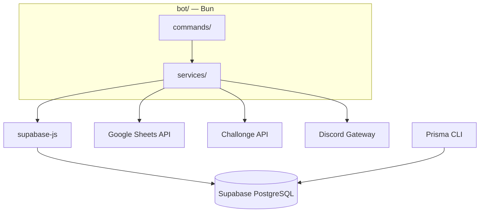

# MW Tournament Bot — Contexto del proyecto

Bot monolítico para gestionar torneos competitivos de **Modern Warships** en Discord. Un solo proceso: comandos, lógica de negocio, persistencia en Supabase e integraciones externas (Challonge, Google Sheets).

> **Idioma del bot:** inglés (mensajes, embeds, slash commands).  
> **Documentación:** español. Ver [`AGENTS.md`](./AGENTS.md).

---

## Objetivo

Arquitectura simplificada: **un bot que accede directo a Supabase** vía `@supabase/supabase-js`, reduciendo latencia y simplificando el despliegue a un solo servicio.

| Enfoque tradicional | Este proyecto |
|---|---|
| Bot → NestJS API → Prisma → DB | Bot → supabase-js → Supabase PostgreSQL |
| Registro web personalizado | Google Sheets (`sheet_link` en torneo) |
| Monorepo con múltiples apps | Bun + `bot/` |
| Prisma en runtime (API) | Prisma solo para migraciones; supabase-js en runtime |

---

## Principio central

**El bot es el único componente de aplicación.** Toda lógica de negocio, validaciones y persistencia viven en `bot/src/services/`. Supabase PostgreSQL es la base de datos; Prisma en `prisma/` solo evoluciona el schema.

### Fuera de alcance

| Responsabilidad | Quién |
|---|---|
| Propuesta y aprobación de torneos | ArtStorm (externo) |
| Contenido del ruleset | Externo (el bot publica enlace URL) |
| Creación y seeding del bracket | Organizador (manual en Challonge) |
| Formulario web de registro | **Omitido** — participantes vía Google Sheet |

---

## Contexto del ecosistema

**Modern Warships** — ~40 servidores Discord reconocidos por **ArtStorm**. Cada servidor organiza torneos con staff y reglas propias. Este bot es el **motor operativo** en cada servidor.

### Multi-servidor

- Configuración por `guildId` en tabla `guilds`
- Hasta **4 torneos activos** por servidor
- Comandos de torneo requieren `tournamentId` (autocomplete)

---

## Arquitectura



### Flujo de registro (Google Sheets)

1. Admin configura torneo con `/tournament add` incluyendo `sheet_link`.
2. Capitanes completan la Google Sheet (columnas definidas por el staff).
3. Bot lee/valida participantes vía Sheets API (`/team info`, `/team list`, `/assign_role`).
4. Opcional: cache en tabla `participants` sincronizada periódicamente.

### Flujo de tickets y auto-room

```text
/tournament add  →  /auto_room run  →  worker + /upload_score crean siguientes salas
       │                    │
       │                    └─ auto_room_enabled = true
       └─ result_channel, categorías, sheet_link, Challonge key

Solo matches Challonge status = open  →  createRoomsForMatches  →  match_rooms (1:1)
```

| Etapa | Comportamiento |
|---|---|
| Alta torneo | Config en `tournaments`; `auto_room_creation` no sustituye a `/auto_room run` si se desea arrancar después |
| `/auto_room run` | Habilita auto-room y procesa cola inicial |
| Tras cada `/upload_score` | Si `auto_room_enabled`, sincroniza y abre tickets para nuevos matches `open` |
| Worker (60 s) | Mismo procesamiento por torneo con auto-room activo |
| 2 etapas | Grupos solo en `group_stages_underway`; no salas `pending`; etapa final cuando Challonge abre matches de eliminación |
| Anti-duplicados | Lock por torneo + `UNIQUE(match_id)` + skip si ya hay `ticket_channel_id` |

Ver [`COMMANDS.md`](./COMMANDS.md) — sección *Sistema auto-room*.

**No hay** página web `/register/[tournamentId]` ni API REST intermedia.

---

## Alcance del bot

1. **Configuración** — Settings, prefijo, multi-servidor
2. **Torneos** — CRUD config, Challonge ID/key, channels/categories
3. **Participantes** — Lectura desde Google Sheets
4. **Bracket (Challonge)** — Read partidos, report resultados
5. **Tickets** — Canales privados por ronda
6. **Schedules** — Horarios, judge/recorder
7. **Resultados** — Upload score, cerrar tickets, transcripts
8. **Attendance** — Tracking staff, links de grabación, reportes XLSX
9. **Transcripts** — HTML al cerrar ticket (solo Discord, no DB)
10. **Staff** — Roles por torneo, assign_role con verificación ban DB

---

## Roles y permisos

| Rol | Cantidad | Acceso |
|---|---|---|
| Organizer | 2 por torneo | Control operativo del torneo asignado |
| Helper | 2–3 por torneo | Tickets, schedules, guía a judges/recorders |
| Judge | — | Salas, reglas, resultado en ticket |
| Recorder | — | Grabación y evidencia |
| Participant (Captain) | — | Solo su ticket |

Ver [`COMMANDS.md`](./COMMANDS.md) para permisos por comando.

### Tickets — acceso a canales

| Momento | Miembros |
|---|---|
| Creación | Organizer, Helper, ambos Team Captains |
| Al crear schedule | + Judge, Recorder |

---

## Integración Challonge

| Operación | Permitido |
|---|---|
| READ bracket/matches | Sí |
| REPORT resultados | Sí |
| CREATE/MODIFY bracket | No |

API key encriptada en `tournaments.challonge_key_encrypted`.

---

## Integración Google Sheets

- URL en `tournaments.sheet_link`
- Service account con acceso de lectura (y opcional sync a `participants`)
- Headers esperados alineados con `/team list` y `/assign_role` (Captain Discord Tag, In-game name, etc.)

---

## Stack tecnológico

| Área | Stack |
|---|---|
| Runtime / package manager | **Bun** |
| Lenguaje | TypeScript (strict) |
| Bot | discord.js v14 |
| DB runtime | `@supabase/supabase-js` + `SUPABASE_SERVICE_ROLE_KEY` |
| DB migrations | Prisma CLI en `prisma/` |
| Base de datos | Supabase (PostgreSQL) |
| Validación | Zod en `bot/src/schemas/` |
| Logs | console / Pino (fase posterior) |

---

## Estructura del repositorio

```
Nexo Support/
├── README.md
├── bot/                    # Aplicación del bot
├── prisma/                 # Schema y migraciones (no runtime)
└── docs/                   # Documentación del proyecto
```

---

## Roadmap (bot-first)

- [x] **Fase 0 — Scaffold** — Estructura, docs, ping + Supabase health check
- [ ] **Fase 1 — Configuración** — Guild settings, prefijo, multi-servidor
- [ ] **Fase 2 — Torneos** — `/tournament *`, Sheets link, CRUD config
- [ ] **Fase 3 — Participantes** — Sheets service, `/team info|list`, cache `participants`
- [ ] **Fase 4 — Staff** — `/assign_role`, guards, ban DB
- [x] **Fase 5 — Challonge** — Read bracket, sync `matches`, report scores
- [x] **Fase 6 — Tickets y rooms** — `/room *`, `/auto_room *`, anti-duplicados, 2 etapas
- [x] **Fase 7 — Schedules** — `/schedule *`
- [x] **Fase 8 — Scores y attendance** — `/upload_score`, attendance, `/get sheet` (parcial según comandos activos)
- [ ] **Fase 9 — Transcripts** — HTML fiel a Discord
- [ ] **Fase 10 — Deploy** — Un solo proceso en producción

---

## Glosario

| Término | Definición |
|---|---|
| **Ticket** | Canal privado = ronda del bracket |
| **Schedule** | Horario de partido; activa Judge/Recorder en ticket |
| **Room** | Canal/sala creado para un partido (1:1 con `matches` vía `match_rooms`) |
| **Auto-room** | Creación automática de tickets cuando Challonge marca un match como `open` |
| **Transcript** | Export HTML del ticket — no en DB |
| **Sheet** | Google Sheet de participantes del torneo |

---

## Documentación

Ver [`INDEX.md`](./INDEX.md) para el mapa completo de archivos.
