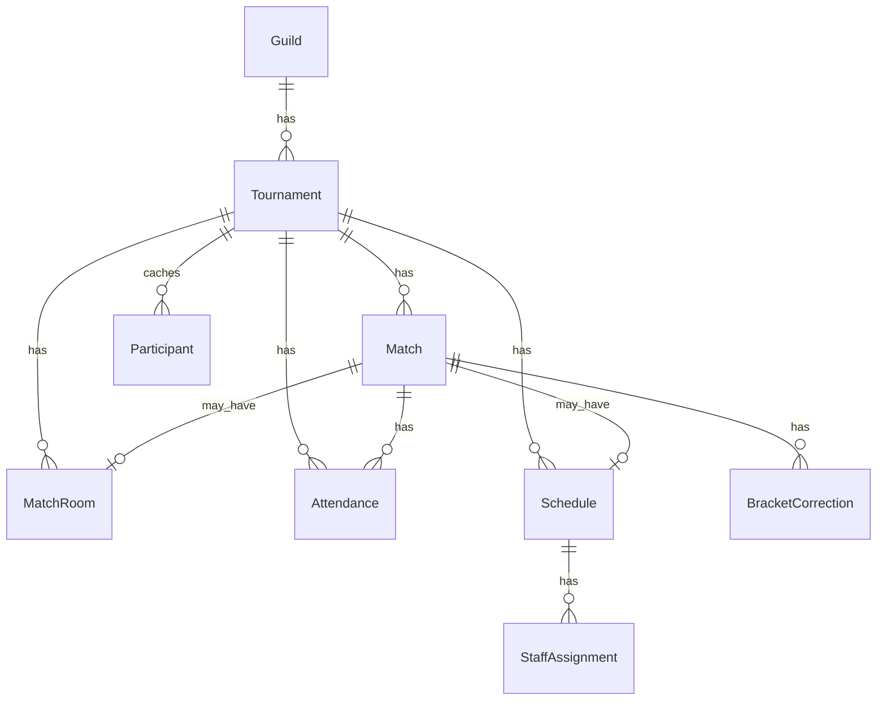

# Base de datos — Supabase PostgreSQL

Esquema de persistencia para el bot monolítico. El bot accede en **runtime** vía `@supabase/supabase-js` (PostgREST). **Prisma** en `prisma/` se usa **solo** para migraciones de schema.

> Participantes del torneo: fuente de verdad en **Google Sheets** (`tournaments.sheet_link`). La tabla `participants` es **cache opcional** sincronizada desde la sheet.

---

## Diagrama ER (simplificado)



---

## Política de acceso (RLS)

| Actor | Acceso |
|---|---|
| Bot (servidor) | `SUPABASE_SERVICE_ROLE_KEY` — bypass RLS, solo en el proceso del bot |
| Clientes públicos | **No hay** — no existe front ni API pública en esta arquitectura |
| Anon key | **No usar** en el bot |

**Reglas:**

- La `service_role` key **nunca** se expone en logs, commits ni variables del cliente.
- Habilitar RLS en todas las tablas con política deny-all por defecto; el bot opera con service role.
- Documentar en deploy que solo un servicio (el bot) tiene la key.

---

## Tablas

### `guilds`

Configuración por servidor Discord (multi-tenant).

| Columna | Tipo | Notas |
|---|---|---|
| `id` | `TEXT` PK | Discord guild ID |
| `prefix` | `TEXT` | Prefijo de comandos (default `[]`) |
| `created_at` | `TIMESTAMPTZ` | |
| `updated_at` | `TIMESTAMPTZ` | |

**Comandos:** settings, multi-servidor global.

---

### `tournaments`

Configuración completa de un torneo en un servidor.

| Columna | Tipo | Notas |
|---|---|---|
| `id` | `TEXT` PK | CUID interno |
| `guild_id` | `TEXT` FK → `guilds` | |
| `name` | `TEXT` | Nombre visible |
| `challonge_id` | `TEXT` | ID del torneo en Challonge |
| `challonge_key_encrypted` | `TEXT` | API key encriptada (nunca plaintext) |
| `sheet_link` | `TEXT` | URL Google Sheet de participantes |
| `admin_role_id` | `TEXT` | Discord role ID (organizer/admin) |
| `helper_role_id` | `TEXT` | Discord role ID |
| `attendance_channel_id` | `TEXT` | |
| `transcript_channel_id` | `TEXT` | |
| `rules_channel_id` | `TEXT` | |
| `deadline_channel_id` | `TEXT` | |
| `result_channel_id` | `TEXT` | Opcional |
| `closed_ticket_category_id` | `TEXT` | |
| `close_ticket_category_2_id` | `TEXT` | Opcional — overflow |
| `ticket_open_category_1_id` | `TEXT` | |
| `ticket_open_category_2_id` | `TEXT` | |
| `ticket_open_category_3_id` | `TEXT` | Opcional |
| `ticket_open_category_4_id` | `TEXT` | Opcional |
| `auto_room_enabled` | `BOOLEAN` | Default `false` |
| `schedules_channel_id` | `TEXT` | Canal de schedules (requerido para `/schedule create`) |
| `created_at` | `TIMESTAMPTZ` | |
| `updated_at` | `TIMESTAMPTZ` | |

**Índices:** `guild_id`.

**Comandos:** `/tournament add|edit|delete|info|list`, `/auto_room *`, `/room *`, `/upload_score`.

**Límite de negocio:** máximo 4 torneos activos por `guild_id` (validar en servicio, no en DB).

---

### `matches`

Partidos sincronizados desde Challonge o creados al abrir tickets.

| Columna | Tipo | Notas |
|---|---|---|
| `id` | `TEXT` PK | CUID interno |
| `tournament_id` | `TEXT` FK → `tournaments` | |
| `challonge_match_id` | `TEXT` | ID externo |
| `round` | `TEXT` | Ronda del bracket |
| `group` | `TEXT` | Grupo/fase para filtrado en `/room create` |
| `team1_name` | `TEXT` | |
| `team2_name` | `TEXT` | |
| `team1_score` | `INTEGER` | Nullable hasta resultado |
| `team2_score` | `INTEGER` | |
| `winner_side` | `INTEGER` | `1`, `2`, o null |
| `status` | `TEXT` | `pending`, `completed`, `open` |
| `ticket_channel_id` | `TEXT` | Canal Discord del ticket |
| `created_at` | `TIMESTAMPTZ` | |
| `updated_at` | `TIMESTAMPTZ` | |

**Índices:** `tournament_id`, `challonge_match_id`, `ticket_channel_id`.

**Comandos:** `/room create|available`, `/upload_score`, `/correct_bracket`, autocomplete de matches.

---

### `match_rooms`

Salas/tickets creados para partidos (tracking de auto-room y manual).

| Columna | Tipo | Notas |
|---|---|---|
| `id` | `TEXT` PK | CUID |
| `tournament_id` | `TEXT` FK → `tournaments` | |
| `match_id` | `TEXT` FK → `matches` | |
| `channel_id` | `TEXT` | Canal Discord creado |
| `category_id` | `TEXT` | Categoría donde se creó |
| `created_at` | `TIMESTAMPTZ` | |

**Índices:** `tournament_id`, `match_id`, `channel_id`.

**Comandos:** `/auto_room *`, `/room create`.

---

### `attendance`

Registros de asistencia y trabajo del staff por partido/ticket.

| Columna | Tipo | Notas |
|---|---|---|
| `id` | `TEXT` PK | CUID |
| `tournament_id` | `TEXT` FK → `tournaments` | |
| `match_id` | `TEXT` FK → `matches` | |
| `ticket_channel_id` | `TEXT` | |
| `judge_discord_id` | `TEXT` | |
| `recorder_discord_id` | `TEXT` | |
| `team1_score` | `INTEGER` | |
| `team2_score` | `INTEGER` | |
| `remark` | `TEXT` | Opcional |
| `recording_link` | `TEXT` | URL de grabación |
| `deleted_at` | `TIMESTAMPTZ` | Soft delete (`/attendance delete`) |
| `deleted_reason` | `TEXT` | |
| `created_at` | `TIMESTAMPTZ` | |
| `updated_at` | `TIMESTAMPTZ` | |

**Índices:** `tournament_id`, `match_id`, `judge_discord_id`, `recorder_discord_id`.

**Comandos:** Attendance completa, `/link *`, `/work_done`, `/get sheet`.

---

### `schedules`

Horarios publicados para partidos en tickets.

| Columna | Tipo | Notas |
|---|---|---|
| `id` | `TEXT` PK | CUID |
| `tournament_id` | `TEXT` FK → `tournaments` | |
| `match_id` | `TEXT` FK → `matches` | |
| `ticket_channel_id` | `TEXT` | |
| `scheduled_at` | `TIMESTAMPTZ` | UTC |
| `schedules_message_id` | `TEXT` | Mensaje en canal de schedules |
| `ticket_message_id` | `TEXT` | Embed en el ticket |
| `thumbnail_url` | `TEXT` | Opcional |
| `created_at` | `TIMESTAMPTZ` | |
| `updated_at` | `TIMESTAMPTZ` | |

**Índices:** `tournament_id`, `match_id`, `ticket_channel_id`.

**Comandos:** `/schedule create|delete|refresh|unassigned|resign`.

---

### `staff_assignments`

Asignaciones de Judge/Recorder a un schedule (soporta resign).

| Columna | Tipo | Notas |
|---|---|---|
| `id` | `TEXT` PK | CUID |
| `schedule_id` | `TEXT` FK → `schedules` | |
| `role` | `TEXT` | `judge`, `recorder` |
| `discord_user_id` | `TEXT` | |
| `resigned_at` | `TIMESTAMPTZ` | Null si activo |
| `resign_reason` | `TEXT` | |
| `created_at` | `TIMESTAMPTZ` | |

**Índices:** `schedule_id`, `discord_user_id`.

**Comandos:** `/schedule create`, `/schedule resign`, `/schedule unassigned`.

---

### `bracket_corrections`

Auditoría de correcciones de score en bracket.

| Columna | Tipo | Notas |
|---|---|---|
| `id` | `TEXT` PK | CUID |
| `tournament_id` | `TEXT` FK → `tournaments` | |
| `match_id` | `TEXT` FK → `matches` | |
| `old_team1_score` | `INTEGER` | |
| `old_team2_score` | `INTEGER` | |
| `new_team1_score` | `INTEGER` | |
| `new_team2_score` | `INTEGER` | |
| `corrected_by_discord_id` | `TEXT` | |
| `created_at` | `TIMESTAMPTZ` | |

**Comandos:** `/correct_bracket`.

---

### `participants` (cache)

Snapshot de participantes leídos desde Google Sheets — **no** formulario web.

| Columna | Tipo | Notas |
|---|---|---|
| `id` | `TEXT` PK | CUID |
| `tournament_id` | `TEXT` FK → `tournaments` | |
| `team_name` | `TEXT` | |
| `discord_tag` | `TEXT` | |
| `discord_id` | `TEXT` | |
| `in_game_name` | `TEXT` | |
| `in_game_id` | `TEXT` | |
| `current_title` | `TEXT` | |
| `seed` | `INTEGER` | Opcional |
| `sheet_row_index` | `INTEGER` | Fila en la sheet |
| `source` | `TEXT` | Siempre `sheet` |
| `synced_at` | `TIMESTAMPTZ` | Última sincronización |

**Índices:** `tournament_id`, `discord_id`, `in_game_id`.

**Comandos:** `/team info`, `/team list`, `/assign_role` (validación cruzada con sheet + ban DB).

**Servicio:** `services/sheets.ts` — leer sheet en vivo; opcionalmente `syncParticipants()` escribe cache.

---

## Mapeo comando → persistencia

| Área | Tablas / servicio |
|---|---|
| Attendance | `attendance` |
| Tournament config | `tournaments`, `guilds` |
| Rooms / auto-room | `matches`, `match_rooms`, `tournaments` |
| Scores / bracket | `matches`, `bracket_corrections` + Challonge API |
| Schedules | `schedules`, `staff_assignments` |
| Teams / participants | Google Sheets + cache `participants` |
| Transcripts | **No en DB** — solo Discord |

---

## Prisma ↔ PostgREST

| Prisma model | Tabla PostgreSQL |
|---|---|
| `Guild` | `guilds` |
| `Tournament` | `tournaments` |
| `Match` | `matches` |
| `MatchRoom` | `match_rooms` |
| `Attendance` | `attendance` |
| `Schedule` | `schedules` |
| `StaffAssignment` | `staff_assignments` |
| `BracketCorrection` | `bracket_corrections` |
| `Participant` | `participants` |

Schema Prisma: [`../prisma/schema.prisma`](../prisma/schema.prisma).

---

## Datos sensibles

| Dato | Almacenamiento |
|---|---|
| Challonge API key | `tournaments.challonge_key_encrypted` — encriptar con `CHALLONGE_KEY_ENCRYPTION_SECRET` |
| Service role key | Solo `.env` del bot — nunca en DB |
| Google credentials | Solo `.env` o archivo local — nunca en DB |

---

## Migraciones

```bash
cd bot
cp ../prisma/.env.example ../prisma/.env   # configurar DATABASE_URL + DIRECT_URL
bun run db:push      # desarrollo
bun run db:migrate   # producción
```

Ver [`../README.md`](../README.md) para el flujo completo con Bun.
